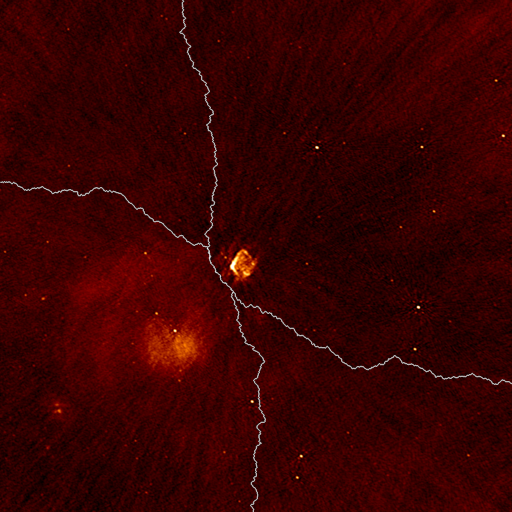

Parallel deconvolution
======================

WSClean can speed up the deconvolution process by separately deconvolving the sub-images. This is highly desirable for cleaning large images, e.g. 15K x 15K LOFAR images, and this became necessary because the :doc:`IDG gridder <image_domain_gridding>` can easily produce such images. Despite that WSClean has very fast multi-scale multi-frequency algorithms, IDG has shifted the computational bottleneck back to the deconvolution process.

The parallel cleaning process is fully automated and is turned on with one parameter: ``-parallel-deconvolution <maxsize>``, which requires one parameter giving the maximum size of the sub-images. Values of 1024-4096 work well for large images. Smaller values would split the image in very many subimages, increases the computational cost of splitting, whereas larger values might lead to too few subimages, and this might therefore lead to lesser parallelization.

Implementation
--------------

Images are split using a (constrained) path-finding algorithm called `Dijkstra's algorithm <https://en.wikipedia.org/wiki/Dijkstra%27s_algorithm>`_, which calculates the smallest absolute path through the image, constrained to be near a desired splitting boundary. The smallest absolute path is re-determined before every major deconvolution iteration. Here is an example on a small image:

